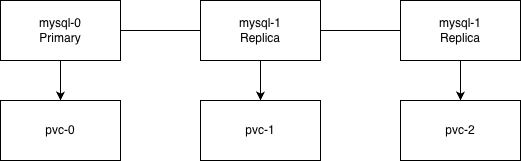

# Kubernetes StatefulSet with MySQL Replication

This guide covers deploying a MySQL cluster with primary-replica replication using StatefulSet.

## Why StatefulSet for Databases?

| Feature | Deployment | StatefulSet |
|---------|------------|-------------|
| Pod identity | Random | Predictable (mysql-0, mysql-1, ...) |
| Storage | Shared PVC | Individual PVC per pod |
| Pod startup | Parallel | Sequential |
| DNS | Service only | Individual pod DNS |

## Architecture



## Components

1. **ConfigMap** - MySQL configuration for primary and replicas
2. **Headless Service** - For stable network identities
3. **Read Service** - For read operations (load balanced)
4. **StorageClass** - Dynamic volume provisioning
5. **StatefulSet** - The MySQL pods with init containers

## Deployment Steps

### 1. Create StorageClass

```bash
kubectl apply -f storage-class.yaml
```

### 2. Create ConfigMap

```bash
kubectl apply -f mysql-configmap.yaml
```

### 3. Create Services

```bash
kubectl apply -f mysql-services.yaml
```

### 4. Deploy StatefulSet

```bash
kubectl apply -f mysql-statefulset.yaml
```

### 5. Initialize Replication

Once all pods are running:

```bash
# Connect to primary
kubectl exec -it mysql-0 -- mysql -u root

# Check replication status on replicas
kubectl exec -it mysql-1 -- mysql -u root -e "SHOW SLAVE STATUS\G"
```

## Accessing MySQL

### Write Operations (Primary Only)

```bash
# Connect directly to primary
kubectl exec -it mysql-0 -- mysql -u root

# Or via DNS
mysql -h mysql-0.mysql.<namespace>.svc.cluster.local -u root
```

### Read Operations (Any Replica)

```bash
# Via mysql-read service (load balanced)
mysql -h mysql-read.<namespace>.svc.cluster.local -u root
```

## Scaling

### Scale Up

```bash
kubectl scale statefulset mysql --replicas=5
```

### Scale Down

```bash
# Scale down carefully - data on removed pods is preserved in PVCs
kubectl scale statefulset mysql --replicas=3
```

## Key Concepts

### Init Containers

1. **init-mysql**: Generates server-id and copies config based on ordinal
2. **clone-mysql**: Clones data from previous replica using xtrabackup

### Sidecar Container

**xtrabackup**: Serves backup data to new replicas via ncat on port 3307

### Pod Identity

- `mysql-0` is always the primary
- `mysql-1`, `mysql-2`, etc. are replicas
- Each pod has stable DNS: `mysql-{ordinal}.mysql.{namespace}.svc.cluster.local`

## Troubleshooting

### Check Pod Status

```bash
kubectl get pods -l app=mysql
kubectl describe pod mysql-0
```

### Check Replication

```bash
kubectl exec mysql-1 -- mysql -u root -e "SHOW SLAVE STATUS\G"
```

### View Logs

```bash
kubectl logs mysql-0 -c mysql
kubectl logs mysql-0 -c xtrabackup
```

### Check PVC Status

```bash
kubectl get pvc -l app=mysql
```

## Backup and Restore

### Create Backup

```bash
kubectl exec mysql-0 -- mysqldump -u root --all-databases > backup.sql
```

### Restore Backup

```bash
kubectl exec -i mysql-0 -- mysql -u root < backup.sql
```

## Best Practices

1. **Use anti-affinity** - Spread pods across nodes
2. **Set resource limits** - Prevent resource contention
3. **Monitor replication lag** - Alert on high lag
4. **Regular backups** - Don't rely only on replication
5. **Test failover** - Know how to promote replica to primary

## References

- [Kubernetes StatefulSets](https://kubernetes.io/docs/concepts/workloads/controllers/statefulset/)
- [MySQL Replication](https://dev.mysql.com/doc/refman/8.0/en/replication.html)
- [Run Replicated Stateful Application](https://kubernetes.io/docs/tasks/run-application/run-replicated-stateful-application/)
